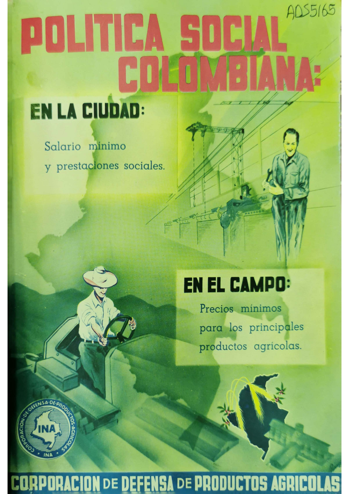
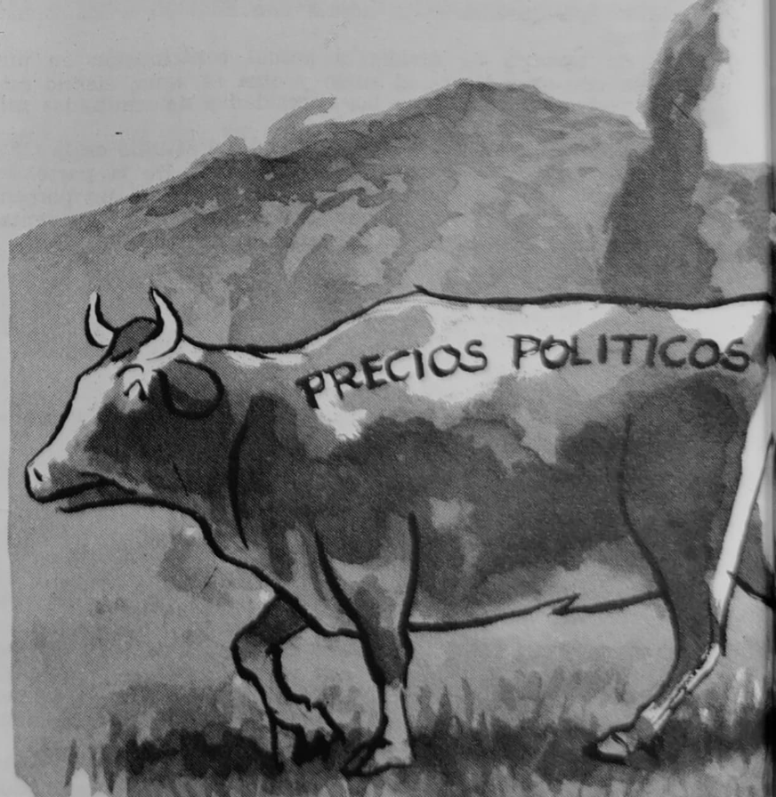

The conventional wisdom holds that governments extract from agriculture to promote industrialization. However, development strategies are not uniform. While some governments did extract from agriculture, others actively supported the sector in what I call agrarian developmentalism. Why do some governments support agriculture while others extract from the sector during industrialization?

  
  

    I argue that this variation is explained by the structure of the party system and rural producers’ legislative strength. Integrative party systems—where parties rely on mixed rural-urban constituencies for electoral support—are more favorable to agriculture. In these systems, politicians from different parties are more likely to endorse pro-rural programs, include rural producers in governing coalitions, and craft intersectoral bargains to solve urban-rural distributional conflicts. In contrast, segmented party systems—where politicians specialize in representing either urban or rural constituencies—foster intersectoral conflict, making generous government support for agriculture less likely. Additionally, rural producers’ legislative strength determines the level of extraction. This formal power allows them to systematically constrain extraction from agriculture. Thus, an integrative party system and rural legislative strength leads to agrarian developmentalism.
  

 

  
  

    I develop the argument through a comparative historical analysis of two countries with divergent development strategies crafted during World War II: Colombia and Chile. In Colombia, the government supported agriculture generously through price support, tariff protection, and public spending. By contrast, the Chilean government sidelined agriculture to promote industrialization. Drawing on original data collected over twelve months of fieldwork from a range of historical sources, I show how the explanatory variables shaped agricultural policy regimes, and demonstrate that alternative approaches focusing on power of rural producers have limited leverage.
  

