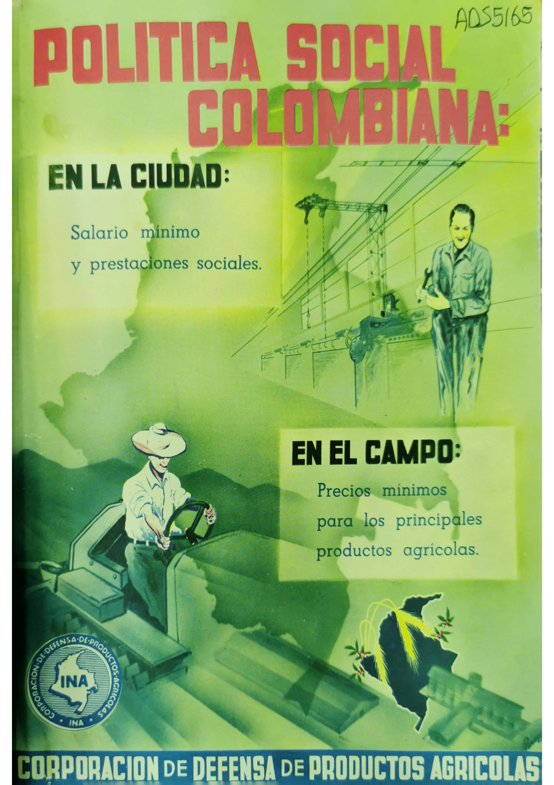
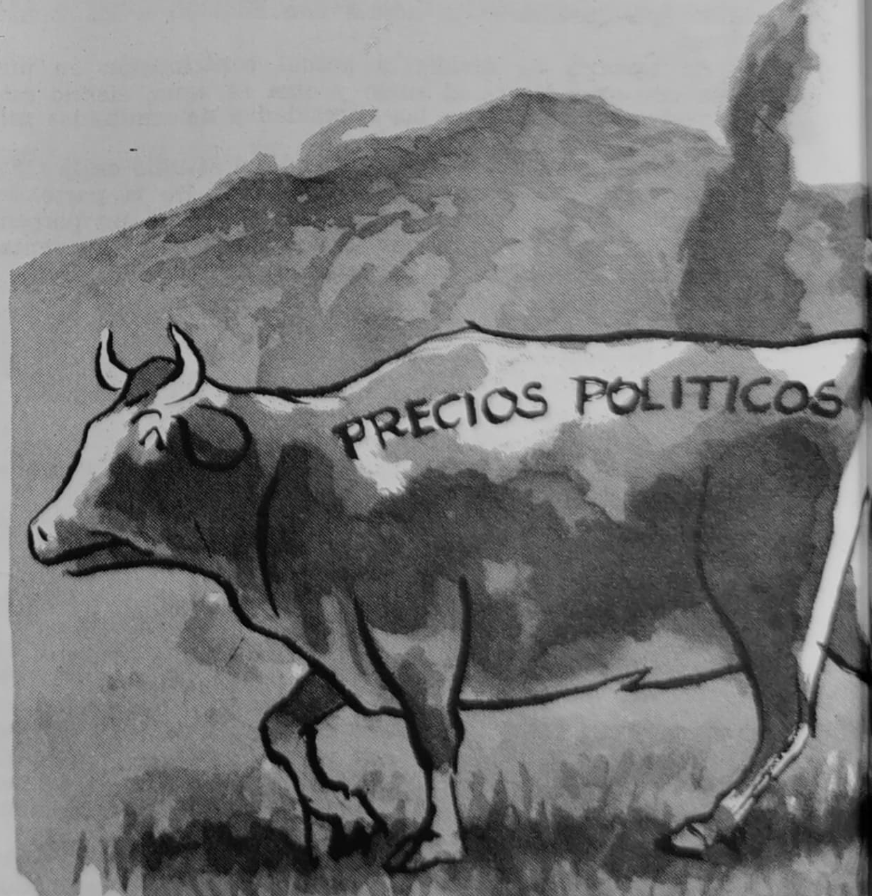

Access a developing Table of Contents of my book [here](https://www.dropbox.com/scl/fi/igddj1973simhonrx6ezy/toc_only.pdf?rlkey=3bx7bjpzn6s5023pwl07unj25&e=1&st=u01djdag&dl=0).

The conventional wisdom holds that governments extracted from agriculture to promote industrialization. However, development strategies were not uniform. While some governments did extract from agriculture, others actively supported the sector in what I call agrarian developmentalism. Why do some governments support agriculture while others extract from the sector during industrialization?

  
  

My book project argues that this variation is explained by the structure of rural representation in the the party system and rural producers’ legislative leverage. Integrative party systems—where parties rely on mixed rural-urban constituencies for electoral support—are more favorable to agriculture. In these systems, politicians from different parties are more likely to endorse pro-rural programs, include rural producers in governing coalitions, and craft intersectoral bargains to solve urban-rural distributional conflicts. In contrast, segmented party systems—where politicians specialize in representing either urban or rural constituencies—foster intersectoral conflict, making generous government support for agriculture less likely. Additionally, rural producers’ legislative leverage determines the level of extraction. This formal power allows rural producers to systematically constrain extraction from agriculture. Thus, an integrative party system and rural legislative leverage produces agrarian developmentalism.
  

 

  
  

I carry out a comparative historical analysis of two countries with divergent development strategies crafted during World War II: Colombia and Chile. In Colombia, the government supported agriculture generously through price supports, tariff protection, and public spending. By contrast, the Chilean government sidelined agriculture to promote industrialization. Drawing on original data collected over twelve months of fieldwork from a range of historical sources, and qualitative and quantitative methods, I show how the explanatory variables shaped agricultural policy regimes, and demonstrate that alternative approaches focusing on power of rural producers have limited leverage.

My dissertation, on which the book project is based, was awarded the Robert Toppan Prize for best dissertation on any subject of Political Science by Harvard's Government Department.
  

